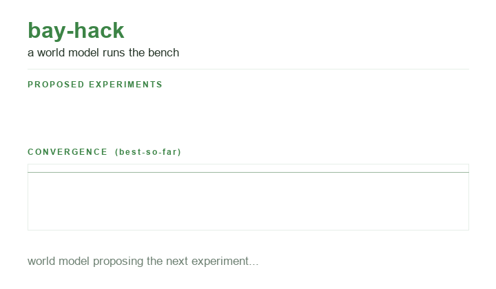
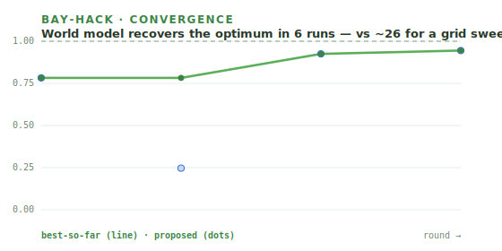

# 🧪🤖 bay-hack

[](https://github.com/di-omics/bay-hack/actions/workflows/ci.yml)

**Two world models close the liquid-handling loop.** Track A entry for the 24hr AI for Science
World Models Hack @ Zeon Systems (Jul 25–26, SF).

**Live site:** https://di-omics.github.io/bay-hack/ &middot; **Pitch slide:** [docs/slide.html](docs/slide.html) &middot; **Trust model:** [ACCEPTANCE.md](ACCEPTANCE.md) &middot; **Measurement adapters:** [MEASUREMENT_ADAPTERS.md](MEASUREMENT_ADAPTERS.md) &middot; **Physical gates:** [VERIFICATION_ADAPTERS.md](VERIFICATION_ADAPTERS.md) &middot; **Bring kit:** [HARDWARE_KIT.md](HARDWARE_KIT.md) &middot; **On-site runbook:** [ONSITE_RUNBOOK.md](ONSITE_RUNBOOK.md)



bay-hack couples two different world models:

1. **Zeon's physical world model** represents the bench, geometry, labware,
   robot state, and safe physical execution.
2. **bay-hack's scientific world model** predicts assay response and chooses the
   next liquid-handling experiment under uncertainty.

The project is the thin glue that composes the
[@di-omics](https://github.com/di-omics) autonomous-lab stack around that loop.
The heavy lifting already lives in the supporting repos.

> Plain-English goal -> a **GP world model** proposes the next 40 uL formulation
> -> an agent executes concrete wells and volumes through **plr-mcp** ->
> fluorescence or camera data plus a **Rhodamine-B gate** and **CV** verify it
> physically -> the assay objective plus a **conformal uncertainty gate** decide
> accept or escalate -> repeat ->
> transfer 20 uL from the accepted well to H12 as the follow-up action.

See **[STRATEGY.md](STRATEGY.md)** for the full winning plan, demo script, and
event countdown.

## Run the loop now (pure simulation, stdlib only)

```bash
python -m bayhack.demo        # narrated CLI run
python -m bayhack.dashboard   # live browser dashboard -> http://127.0.0.1:8000
python -m bayhack.demo --ledger run_artifacts/trust.json
python -m bayhack.safety      # unsafe plan refused with zero robot commands
python -m bayhack.preflight   # complete zero-motion readiness audit
python -m bayhack.dashboard --receipt run_artifacts/trust.json  # zero-motion replay
```

You'll watch the world model recover a planted optimum in about 6 runs versus 26
for a grid sweep. All six runs, including the two seed experiments, pass plan,
Rhodamine, and CV gates before they train the model. The dashboard shows the
destination well, stock and diluent volumes, signal, convergence, acceptance,
and the verified follow-up transfer.

## The portable liquid-handling assay

| Position | Role |
|---|---|
| A1 | assay stock |
| A2 | diluent |
| B1 onward | 40 uL world-model proposals |
| H12 | receives 20 uL from the accepted well |

Each proposal becomes two verified source-to-destination transfers with unique
tips. The default run is modeled, and the trust ledger says so explicitly. At
the venue, connect either a plate reader or camera measurement without changing
the scientific loop. See [HARDWARE_KIT.md](HARDWARE_KIT.md) for the exact pack list.

ACCEPT no longer depends on the simulator's hidden planted optimum. A run must
clear both the declared assay objective, signal at least 0.85 by default, and
the uncertainty gate. That same policy works when the physical bench exposes no
ground truth.

## Prove verification before action

```bash
python -m bayhack.safety --fault tip_reuse \
  --output run_artifacts/refusal.json
```

The demo deliberately assigns one tip to two liquids. Plan verification refuses
it before backend dispatch, issuing zero robot commands, taking no measurement,
making no model update, and blocking follow-up. A corrected plan then verifies.
The dashboard's **Prove refusal** button shows this failure and recovery live.

## Connect a physical measurement

Use the shipped adapters instead of modifying the controller:

```bash
# plate-reader export, normalized from raw RFU references
python -m bayhack.measurements csv run_artifacts/reader.csv B1 \
  --raw-low 100 --raw-high 1100

# top-down plate image, normalized from A2 low and A1 high references
python -m bayhack.measurements camera run_artifacts/plate_B1.jpg \
  run_artifacts/camera-calibration.json B1
```

`CsvWellMeasurement` and `CameraWellMeasurement` plug directly into
`PlrMcpBench(measurement_fn=...)`. Their ledger labels are
`measured:reader-csv` and `measured:camera`. See
[MEASUREMENT_ADAPTERS.md](MEASUREMENT_ADAPTERS.md) for calibration and wiring.

## Earn physical validation from real evidence

The loop no longer trusts a caller-supplied hardware label. It promotes a run to
`hardware-validated` only when both shipped measured gates pass:

```bash
python -m bayhack.verification volume-csv run_artifacts/volume-gate.csv
python -m bayhack.verification cv-json run_artifacts/cv_B1_1.json
```

`CsvVolumeGate` checks an independent standard curve plus replicated robot
dispenses for R2, accuracy, and CV. `JsonCvCheckpoint` requires a named visual
checkpoint, inspector, verdict, note, and traceable image or trace ID. Both
preserve their evidence and source-file SHA-256 digests in the trust receipt,
then fail closed on incomplete input. See
[VERIFICATION_ADAPTERS.md](VERIFICATION_ADAPTERS.md).

Before any venue backend is initialized, audit the complete fallback and every
evidence file from one zero-motion command:

```bash
python -m bayhack.preflight --output run_artifacts/preflight.json
```

The default result is `SIMULATION_READY`. Once a measured reader or camera value,
volume CSV, and CV checkpoint all pass, it becomes `PHYSICAL_EVIDENCE_READY`.
It never homes or moves hardware, and always reports `ready_for_motion: false`.

After a physical run, replay its measured receipt on the dashboard without
moving hardware again:

```bash
python -m bayhack.dashboard --receipt run_artifacts/trust.json
```

## The numbers



```bash
python -m bayhack.benchmark
```

Across 30 seeds the world model recovers the planted optimum in **~6 runs**
(100% convergence, avg |x&minus;x*| about 0.006) versus a **~26-run** grid sweep,
a **4.3&times;** speedup. The search uses about **240 uL and 12 tips** versus
**1,040 uL and 52 tips** for the grid, saving about **800 uL and 40 tips** before
the common follow-up step. With the real `ml-bio-eval` gate installed, the
split-conformal QC gate holds **~0.90 empirical coverage** (target 1&minus;&alpha; = 0.90).

## Run it through the real @di-omics stack, still with no hardware

```bash
pip install -e ../plr-mcp -e ../plr-epigenome -e ../plr-lab-robot
PYTHONPATH=../../ml-bio-eval/lab-world-model \
  python -m bayhack.demo --real
```

`bayhack/seams.py` holds lazy adapters that swap the stdlib stand-ins for your
actual code, **verified to run with no instrument**:

- **Execute** -> `plr_mcp.lab.Lab` (chatterbox) runs the real pick/aspirate/
  dispense/read choreography.
- **Verify** -> `tipseq_plr.validation.evaluate` (the real Rhodamine gate, reaches
  `tier=liquid_tested`, R²=1.0) + `tipseq_plr.steps.vision.SimVision`.
- **Design/Learn** -> `labworld` GP + ParEGO + the split-conformal QC gate
  (empirical coverage ~0.90 at α=0.10).
- **Plan** -> `tipseq_plr.sow` compiles English into a routed protocol.
- **Dexterity** -> `plr_lr` `Workcell.sim()` moves a plate between taught sites.
- **Physical MCP** -> an agent drives the loop over the real `plr-mcp` **MCP server**
  (stdio). `python -m bayhack.mcp_agent` calls `plr_setup_deck` ->
  `plr_transfer` -> `plr_read_plate` through the protocol boundary. This is the host's
  "Physical MCP" thesis, running.

**Honest by design (so it survives judge questions):**
- PyLabRobot 0.2.1's chatterbox plate reader returns zeros and is decoupled from
  what was dispensed, so the numeric fluorescence stays **modeled** until a real
  reader + reagents are wired on-site. The pipetting/read *choreography* is real.
- Compiled protocols report `validation_tier=untested`; nothing is promoted to
  `liquid_tested`/`biovalidated` until real Rhodamine data clears the gate.
- A device value is labeled measured, not hardware-validated, until the physical
  volume and CV gates also pass.
- A manual `hardware-validated` string cannot bypass the measured gates.

## What composes into what

`bayhack/loop.py` is the orchestrator. Every stage is a **SEAM** to a real repo:

| Stage | Seam to the supporting repo |
|---|---|
| Scientific design | `ml-bio-eval/lab-world-model`: GP + ParEGO |
| Build / Test | `plr-mcp`: `plr_setup_deck`, `plr_transfer`, `plr_read_plate` |
| Physical world | Zeon's scene, geometry, state, and workflow executor |
| Move / dexterity | `plr-lab-robot` (`plr_lr`): `Workcell`, `vision_guided_pick`, `DecapSkill` |
| Verify volumes | `plr-epigenome`: `validation/rhodamine.py` |
| Verify steps | `plr-epigenome` `steps/vision.py` + `lab-cv` |
| Learn | `ml-bio-eval`: split-conformal uncertainty plus the declared assay objective |
| Plan | `plr-epigenome`: `tipseq_plr/sow.py` |
| **Bridge** | `bayhack/zeon_bridge.py`: adapter from PLR actions to Zeon workflows |

Out of the box those seams use tiny stdlib stand-ins so the loop runs with
nothing installed. The real adapters live in **[`bayhack/seams.py`](bayhack/seams.py)**
and fire when the repos are installed (`python -m bayhack.demo --real`, above).
See **[KICKOFF_PROMPT.md](KICKOFF_PROMPT.md)** and **[CLAUDE.md](CLAUDE.md)** for
the on-site build order (real reader, hardware confirms, the Zeon arm backend).

## Wire it up

```bash
# from a folder containing your repos as siblings
pip install -e ../plr-mcp -e ../plr-lab-robot -e ../plr-epigenome
# ml-bio-eval components install per-folder (see its README)
```

Then open your coding agent in this folder and use `KICKOFF_PROMPT.md`.

## The Zeon composition

Zeon's published stack describes a living digital twin that tracks geometry,
physical state, and scientific state for safe workflow execution. bay-hack adds
the complementary assay-response model that decides which formulation to run
next. `bayhack/zeon_bridge.py::ZeonArmBackend` exercises the adapter shape in
simulation today. On-site, map its enumerated seams to the Python workflow or
skill API Zeon provides. The pure-PLR loop remains the guaranteed fallback.

See Zeon's official descriptions of its
[world model and workflow executor](https://www.zeonsystems.ai/blog/inside-the-zeon-stack)
and the event's requirement to connect
[planning, execution, measurement, and follow-up](https://luma.com/avi3l01q).

## Repository rules

See [HOUSE_RULES.md](HOUSE_RULES.md). Authorship stays `di-omics`, claims stay
evidence-bounded, physical plans are verified before execution, and modeled
measurements are never presented as measured.

MIT licensed.
